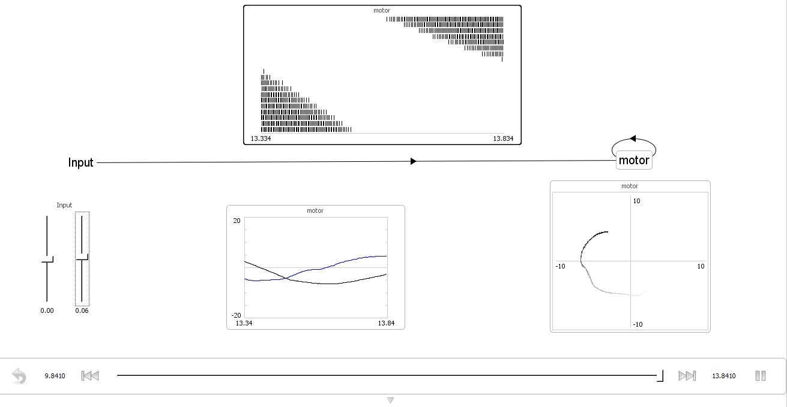
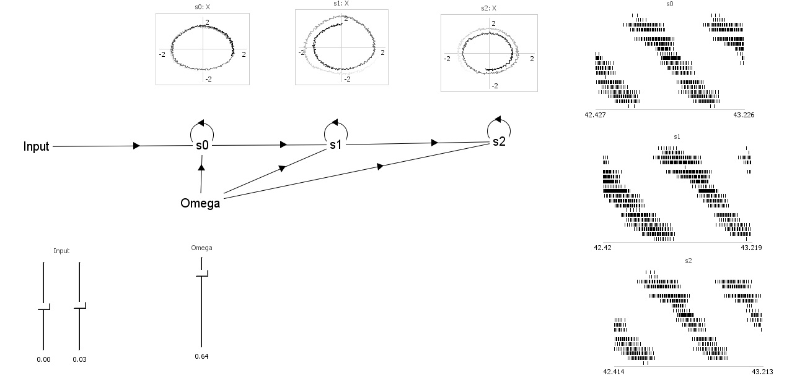

Lamprey locomotion and tuning
=============================

## Goals

To use Nengo, a "new" software program (introduced at the workshop) to
simulate previously recorded (A. Cohen et al. '82) motor sensory data
of the lamprey. To see if the simulation reacted, or could react, in
the same way as the in vivo recordings (A. McClellan and A. Hagevik
'97; Vogelstein et al.) when turning motion was stimulated.

## Motivation

Previous studies have been submitted that extracted data defining the
motor sensory output of the parasitic vertebrate lamprey. This project
was based on these studies, attempting to simulate the neuronal data
already gathered, the mid workshop simulation allowed participants to
link with a java based lego Mindstorms robot demonstrating the lamprey
movement.

Post robot demonstration, further studies where called upon that have
been able to extract sensory motor data relating to turning, where the
one side of the oral hood is stimulated, producing turning in the
opposite direction.

## Results

Nengo simulation of lamprey demonstrated (output spike raster and
preferred direction vector)

A model that includes coupled oscillators, replicating the different
responses along the length of the lamprey's spine. This model is for
two segments.

Lamprey like movement was produced post linking Nengo through RCX
tools (LejOS)

## Files

- `lamprey05_turnRight_showWeights.py`: final workings of the
  simulation, details of parameters in commented code
- `lamprey01.py`: first operational simulation
